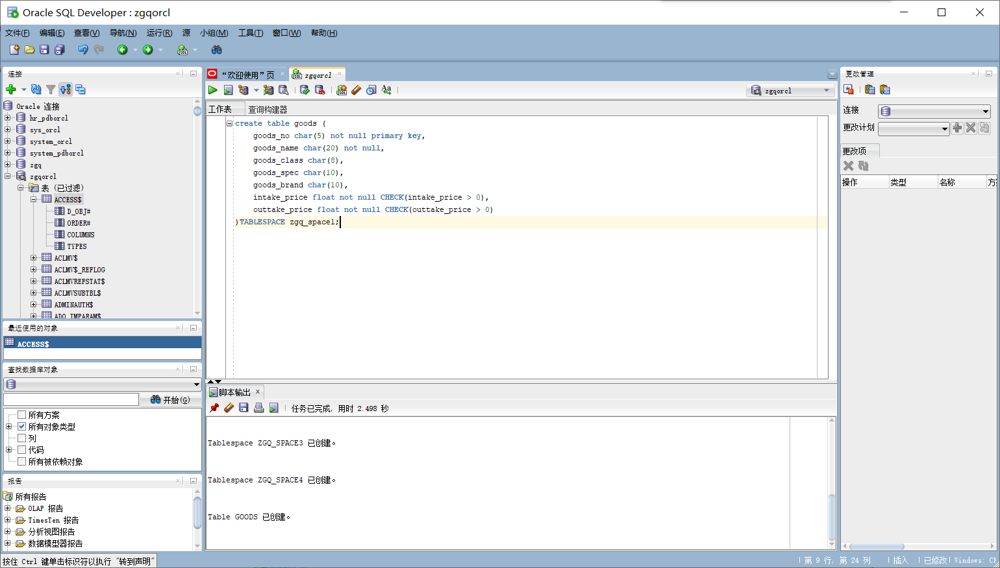

# 实验六（期末考核）基于Oracle的购物系统数据库设计
# 系统概述

&nbsp;	网上商城类似于现实世界当中的商店 ，差别是利用电子商务的各种手段，达成从买到卖的过程的虚拟商店，从而减少中间环节，消除运输成本和代理中间的差价，造就对普通消费，和加大市场流通带来巨大的发展空间。尽可能的还消费者以利益，带动公司发展和企业腾飞，引导国民经济稳定快速发展，推动国内生产总值。在现如今WEB2.0时代，新的产业在不断衍生，电子商务的兴起，为互联网创业者提供了更多的机会。&nbsp;&nbsp;&nbsp;&nbsp;&nbsp;&nbsp;

# 业务流程
- ## 物品销售管理:
    客户来到销售商购买商品，挑选商品，选择购买数量，然后下单给销售商，提取货物或邮寄货物。
    
- ## 代理商调配管理:
    收到销售商的单子后，代理商调配货物给销售商，并根据本地库存从总库存补充货物。代理商应该有：代理商号，代理商名，负责人名字，电话，置入商品编号信息。

- ## 食品存取管理:
     为了商品安全，商品陈列设施要合理，根据商品类型分开存放，仓库根据销售商对商品的需求以及库存信息购进商品。购进物品后，工作人员要对商品进行检查，将不合格的商品不准入库并进行退货处理，进库的商品应该给与入库时间，商品编号，入库数量，和货架编号记录在系统上。出库时应该记录出库时间。

# 数据库设计
- 商品表

    |||商品表（goods） |||
    | - | :-: | :--: |:--: |---- |
    |属性名|数据类型|是否为空|主键/外键|备注|
    |goods_no|	char(5)|	否|	主键|商品编号|
    |goods_name| char(20) | 否 |	|商品名称|
    |goods_class| char(8) |  |	|商品分类|
    |goods_spec| char(10) |  |	|商品规格|
    |goods_brand| char(10) |  |	|商品品牌|
    |intake_price| float | 否 |	|入库单价|
    |outtake_price| float | 否 |	|出库单价|

- 食品库存表

    |||食品库存表（stock） |||
    | - | :-: | :--: |:--: | -: |
    |属性名|数据类型|	是否为空| 主键/外键 | 备注 |
    |stock_no|	char(5)|	否|		|库内编号|
    |goods_no|	char(5)	|否	|外键	|商品编号|
    |size|	char(10)|			||商品数量|
    |position|	char(20)|||货架编号|
    |store_time|	char(10)|		|	|入库时间|
    |take_time|	char(10)|			||出库时间|
    |outtake_size|	char(10)|	||出库数量|

- 代理商表

    |||代理商表（agent）|||
    | - | :-: | :--: |:--: | -: |
    |属性名|	数据类型|	是否为空|	主键/外键| 备注 |
    |agent_no|	char(5)|	否|	主键	|代理商号|
    |office_name|	char(10)|	否|		|代理商名|
    |agent_name|	char(5)|	否|	外键	|负责人名字|
    |telephone|	char(11)|||电话|
    |goods_no|	char(10)|		|外键	|商品编号|

- 零售商表

    |||零售商（retailer）|||
    | - | :-: | :--: |:--: | -: |
    |属性名|数据类型|	是否为空|	主键/外键| 备注 |
    |retailer_no|char(5)| 否 | 主键 | 零售商编号 |
    |retailer_name|char(10)| 否 |	| 店名 |
    |category|char(2)| 否 |	| 类别 |
    |agent_no|char(5)| 否 | 外键 | 代理商号 |
    |title|char(10)| 否 |	| 等级 |
    |admission_time|char(10)| 否 |	| 开业时间 |
    |birthday|char(10)|  |	| 加盟时间 |

- 订单表

    |||订单（registration_form）|||
    | - | :-: | :--: |:--: | -: |
    |属性名|	数据类型|	是否为空|	主键/外键| 备注 |
    |registration_no| char(5) | 否 | 主键 | 订单编号 |
    |agent_no| char(5) | 否 | 外键 | 代理商号 |
    |registration_class| char(15) | 否 |	| 订单类别 |
    |exit| char(2) |	|	| 是否退号 |
    |price| float |	|	| 订单价格 |
    |date| char(10) |	|	| 订单日期 |

- 客户表

    |                 |          | 客户（customer） |           |            |
    | --------------- | :------: | :--------------: | :-------: | ---------: |
    | 属性名          | 数据类型 |     是否为空     | 主键/外键 |       备注 |
    | customer_no     | char(5)  |        否        |   主键    |   客户编号 |
    | custome_name    | char(10) |        否        |           |   客户姓名 |
    | goods_class     | char(2)  |        否        |           |   商品类型 |
    | class           | char(8)  |        否        |           |   客户等级 |
    | tel             | char(11) |                  |           |   客户电话 |
    | retailer_no     | char(20) |                  |   外键    | 零售商编号 |
    | address         | char(20) |        否        |           |       住址 |
    | registration_no | char(5)  |        否        |           |   订单编号 |

# 创建数据库，表空间，表，以及用户
## 创建数据库

- 创建了一个名叫zgqorcl的数据库

    


## 创建表空间

+ 创建管理员

  ```
   create user zgq identified by 123;
   grant dba to zgq; 
  ```

- 连接自己的数据库
 


- 创建表空间

    在zgqorcl数据库中创建了表空间zgq_space1、zgq_space2、zgq_space3、zgq_space4。


    create tablespace 
    zgq_space1
    datafile 'D:/ORACLE/ORADATA/ZGQORCL/zgq_space1.dbf' 
    size 20M 
    autoextend on next 5m
    maxsize unlimited;
    
    create tablespace zgq_space2 DATAFILE
    'D:/ORACLE/ORADATA/ZGQORCL/zgq_space2.bdf' SIZE 50M
    AUTOEXTEND ON NEXT 5M MAXSIZE 100M;
    
    create tablespace zgq_space3 DATAFILE
    'D:/ORACLE/ORADATA/ZGQORCL/zgq_space3.bdf' SIZE 50M
    AUTOEXTEND ON NEXT 5M MAXSIZE 100M;
    
    create tablespace zgq_space4 DATAFILE
    'D:/ORACLE/ORADATA/ZGQORCL/zgq_space4.bdf' SIZE 50M
    AUTOEXTEND ON NEXT 5M MAXSIZE 100M;


## 创建表以及将订单表进行分区
- 创建商品表
    ```sql
    create table goods (
        goods_no char(5) not null primary key,
        goods_name char(20) not null,
        goods_class char(8),
        goods_spec char(10),
        goods_brand char(10),
        intake_price float not null CHECK(intake_price > 0),
        outtake_price float not null CHECK(outtake_price > 0)
    )TABLESPACE zgq_space1;
    ```
    
  
- 创建储存表
    ```sql
    create table stock (
        goods_no char(5) not null,
        stock_no char(20) not null,
        size_ char(10),
        position_ char(20),
        store_time date not null,
        take_time date not null,
        outtake_size char(10),
        CONSTRAINT stock_goods_fk1 FOREIGN KEY (goods_no) REFERENCES goods (goods_no)
    )TABLESPACE zgq_space1;
    ```
    

 


- 创建代理商表
    ```sql
    create table agents (
        agent_no char(5) not null primary key,
        office_name char(10) not null,
        agent_name char(10) not null,
        telephone char(11),
        goods_no char(5),
        CONSTRAINT agents_goods_fk1 FOREIGN KEY (goods_no) REFERENCES goods (goods_no)
    )TABLESPACE zgq_space1;
    ```
    


- 创建零售商表
    ```sql
    create table retailer (
        retailer_no char(5) not null primary key,
        retailer_name char(10) not null,
        categorys  char(10) not null,
        agent_no char(5) not null,
        title char(10),
        admission_time date not null,
        birthday date not null,
        CONSTRAINT retailer_agents_fk1 FOREIGN KEY (agent_no) REFERENCES agents (agent_no)
    )TABLESPACE zgq_space1;
    ```
    
    
    
-  创建订单表
    将订单时间（registration_date），进行分区，分别将2018年之前的数据放在表空间zgq_space1, 将2019 到 2018年的数据放在了表空间zgq_space2，将2020年 到 2019年的数据放在了表空间zgq_space3,最后将大于2020年的数据放在了zgq_spcae4里面。
    
    ```sql
    create table registration_form 
    (
    registration_no char(5 byte) not null primary key
    , agent_no char(5 byte) not null 
    , registration_class char(15 byte) not null 
    , exit_ char(2 byte) 
    , price float(126) 
    , registration_date date not null 
    , constraint registration_form_agent_fk1 foreign key (agent_no) references agents (agent_no)
    ) partition by range (registration_date)
    (
    partition p1 values less than (to_date(' 2018-01-01 00:00:00', 'syyyy-mm-dd hh24:mi:ss', 'nls_calendar=gregorian')) tablespace zgq_space1,
    
    partition p2 values less than (to_date(' 2019-01-01 00:00:00', 'syyyy-mm-dd hh24:mi:ss', 'nls_calendar=gregorian')) tablespace zgq_space2,
    
        partition p3 values less than (to_date(' 2020-01-01 00:00:00', 'syyyy-mm-dd hh24:mi:ss', 'nls_calendar=gregorian')) tablespace zgq_space3,
        
        partition p4 values less than (maxvalue) tablespace zgq_space4
    )
    ```
    


- 创建客户表
    ```sql
    create table customer (
        customer_no char(5) not null primary key,
        customer_name char(10) not null,
        goods_class char(10) not null,
        class char(10) not null,
        tel  char(11),
        retailer_num char(5),
        address char(20),
        registration_no char(5)
    )TABLESPACE zgq_space1;
    ```
    


## 创建用户，授权，插入数据，以及对分区的验证
- 创建用户并授权
    分别创建两个用户zgq_user1和zgq_user2,并允许他们是使用zgq_space1表空间
    ```sql
    create user zgq_user1 IDENTIFIED by 123;
    create user zgq_user2 IDENTIFIED by 123;
    alter user zgq_user1 quota unlimited on zgq_space1;
    alter user zgq_user2 quota unlimited on zgq_space1;
    ```
    


- 创建角色并授权

    创建两个角色zgq_role1，zgq_role2，并分别赋予zgq_role1只有读表，zgq_role2读任何表和读、修改任何表的权利；
    ```sql
    create role zgq_role1;
    create role zgq_role2;
    grant select any table to zgq_role1;
    grant select any table to zgq_role2;
    grant update any table to zgq_role2;
    ```
    
    
- 创建角色赋予用户
    将zgq_role1，zgq_role2分别赋予给用户zgq_user1，zgq_user2
    ```sql
    grant zgq_role1 to zgq_user1;
    grant zgq_role2 to zgq_user2;
    ```
    


## 插入数据 
- 这里插入了50000条数据
    ```sql
    declare
    dt date;
    registration_no char(5);
    agent_no char(5);
    registration_class char(15);
    exit_  char(2);
    price float;
    begin
    
    
    insert into goods (goods_no,goods_name,goods_class,goods_spec,goods_brand,intake_price,outtake_price) values ('1','冰箱','家电','100L','美的',1500.0,2000.0);
    insert into goods (goods_no,goods_name,goods_class,goods_spec,goods_brand,intake_price,outtake_price) values ('2','电视机','家电','24英寸','乐视',2000.0,3000.0);
    insert into goods (goods_no,goods_name,goods_class,goods_spec,goods_brand,intake_price,outtake_price) values ('3','优酸乳','饮料','450g/瓶','伊利',1.5,2.5);
    insert into goods (goods_no,goods_name,goods_class,goods_spec,goods_brand,intake_price,outtake_price) values ('4','水杯','家用','500ml/个','乐扣',65.0,80.0);
    insert into goods (goods_no,goods_name,goods_class,goods_spec,goods_brand,intake_price,outtake_price) values ('5','乐事','视频','500g/袋','乐事',2.5,5.0);

    insert into agents (agent_no,office_name,agent_name,telephone,goods_no) values ('1001','沃尔玛','小王','110','1');
    insert into agents (agent_no,office_name,agent_name,telephone,goods_no) values ('1002','好乐购','小李','119','2');
    insert into agents (agent_no,office_name,agent_name,telephone,goods_no) values ('1003','伊藤洋','小高','120','3');
    insert into agents (agent_no,office_name,agent_name,telephone,goods_no) values ('1004','千盛','小曾','999','4');
    insert into agents (agent_no,office_name,agent_name,telephone,goods_no) values ('1005','百家乐','小肖','111','5');
    for i in 1..50000
    loop
        if i mod 3 =0 then
        dt:=to_date('2018-01-01','yyyy-mm-dd')+(i mod 60); 
    --PARTITION_2018
        elsif i mod 6 =1 then
        dt:=to_date('2019-01-01','yyyy-mm-dd')+(i mod 60); 
    --PARTITION_2019
        elsif i mod 6 =2 then
        dt:=to_date('2020-01-01','yyyy-mm-dd')+(i mod 60); 
    --PARTITION_2020
        end if;
        --插入挂号单
        registration_no := i;
        agent_no := case i mod 6 when 0 then '1001' when 1 then '1002' when 2 then '1003' when 4 then '1004' else '1005'end;
    registration_class := CASE i MOD 6 WHEN 0 THEN '零售' WHEN 1 THEN '批发' WHEN 2 THEN'少量批'WHEN 3 THEN '网络' WHEN 4 THEN '换货' ELSE '折扣' END;
        exit_ := case i mod 2 when 0 then 'Y' ELSE 'N' end;
        price := dbms_random.value(5,30);
        insert /*+append*/ into registration_form (registration_no,agent_no,registration_class,exit_,price,registration_date)
    values (registration_no,agent_no,registration_class,exit_,price,dt);
    
    end loop;
    end;
    ```
    


## 验证分区
根据REGISTRATION_FORM表中的REGISTRATION_DATE字段根据时间段的不同，将其放在了不同的表空间里面，所以每个分区都应该有数据。
```sql
select count(*) from REGISTRATION_FORM PARTITION(p2);
select count(*) from REGISTRATION_FORM PARTITION(p3);
select count(*) from REGISTRATION_FORM PARTITION(p4);
```
由下图可知，每个表空间里面均有REGISTRATION_FORM的数据，也可证明分区成功。


# 程序包的建立
<strong>建立一个程序包，里面有一个函数和一个存储过程，其功能分别为：统计一段时间内的挂号总收入；统计一段时间内，各个代理商订单数。</strong>
```sql
create or replace PACKAGE MyPack IS
  FUNCTION Get_TOTAL(dt1 char,dt2 char) RETURN NUMBER;
  PROCEDURE get_people(dt1 char,dt2 char);
END MyPack;
/
create or replace PACKAGE BODY MyPack IS
FUNCTION Get_TOTAL(dt1 char,dt2 char) RETURN NUMBER
  AS
    N  NUMBER;
    BEGIN
     select sum(price) into N from REGISTRATION_FORM where REGISTRATION_DATE >= to_date(dt1,'yyyy-mm-dd hh24:mi:ss')
     and REGISTRATION_DATE <= to_date(dt2,'yyyy-mm-dd hh24:mi:ss');
       RETURN N;
    END;

PROCEDURE get_people(dt1 char,dt2 char)
  AS
    a1 NUMBER;
    b1 NUMBER;
    c1 NUMBER;
    d1 NUMBER;
    e1 NUMBER;
    f1 NUMBER;
    cursor cur is
      select * from REGISTRATION_FORM where REGISTRATION_DATE >= to_date(dt1,'yyyy-mm-dd hh24:mi:ss')
      and REGISTRATION_DATE <= to_date(dt2,'yyyy-mm-dd hh24:mi:ss');
    begin
      a1 := 0;
      b1 := 0;
      c1 := 0;
      d1 := 0;
      e1 := 0;
      f1 := 0;
      --使用游标
      for v in cur 
      LOOP
         if v.REGISTRATION_CLASS = '零售'
            then a1 := a1 + 1;
         elsif v.REGISTRATION_CLASS = '批发'
            then b1 := b1 + 1;
         elsif v.REGISTRATION_CLASS = '少量批'
            then c1 := c1 + 1;
         elsif v.REGISTRATION_CLASS = '网络'
            then d1 := d1 + 1;
         elsif v.REGISTRATION_CLASS = '换货'
            then e1 := e1 + 1;
         elsif v.REGISTRATION_CLASS = '折扣'
            then f1 := f1 + 1;
         end if;
     END LOOP;
      DBMS_OUTPUT.PUT_LINE('零售商品数为：' ||  a1);
      DBMS_OUTPUT.PUT_LINE('批发商品数为：' ||  b1);
      DBMS_OUTPUT.PUT_LINE('少量批商品数为：' ||  c1);
      DBMS_OUTPUT.PUT_LINE('网络数商品为：' ||  d1);
      DBMS_OUTPUT.PUT_LINE('换货商品数为：' ||  e1);
      DBMS_OUTPUT.PUT_LINE('折扣商品数为：' ||  f1);
    end;
END MyPack;
```


- 函数：
    ```sql
    select MYPACK.GET_TOTAL('2018-03-21 12:00:00','2019-02-28 12:00:00') AS 总收入 FROM dual;
    ```
    
- 存储过程：
    ```sql
    set SERVEROUTPUT ON
    DECLARE
    dt1 char(30);
    dt2 char(30);
    BEGIN
    dt1 :='2018-03-21 12:00:00';
    dt2 :='2019-02-28 12:00:00';
    MYPACK.GET_PEOPLE(dt1,dt2);
    END;
    ```
    


# 系统定时自动备份
## 编写备份脚本
```sh
@echo off

forfiles /p "D:\Oracle\oradata\backup" /d -30 /c "cmd /c echo deleting @file ... && del /f @path" 
echo 执行完成！

set RAR_CMD="C:\Users\ASUS\AppData\Roaming\Microsoft\Windows\Start Menu\Programs\WinRAR.exe"
set SIDDISCRIBE=127.0.0.1:1521/zgqorcl
set DIRECTIONPATH=D:\Oracle\oradata\backup
set hour=%time:~,2%
if "%time:~,1%"==" " set hour=0%time:~1,1%
set TIMESTYLE=%date:~0,4%-%date:~5,2%-%date:~8,2%


echo ============================================
echo 设置数据库参数
echo ============================================
set USERNAME=zgq
set PASSWORD=123
set CONDETION=%USERNAME%/%PASSWORD%@%SIDDISCRIBE%

echo ============================================
echo 设置数据库导出文件、日志文件、压缩文件路径属性名称
echo ============================================
set FILEPATH=%DIRECTIONPATH%/%USERNAME_2018%_%TIMESTYLE%.dmp
set LOGPATH=%DIRECTIONPATH%/%USERNAME_2018%_%TIMESTYLE%.log
set RARPATH=%DIRECTIONPATH%/%USERNAME_2018%_%TIMESTYLE%.rar

echo ============================================
echo 备份Oracle数据库，请稍等......
echo ============================================

exp userid=%CONDETION% file=%FILEPATH% log=%LOGPATH%

echo 备份完成！

echo ============================================
echo 压缩备份文件，请稍等......
echo ============================================

%RAR_CMD% a -df "%RARPATH%" "%FILEPATH%" "%LOGPATH%"

echo 压缩完成！

```
## 开始备份
+ 创建定时任务完成每天自动备份


## 查看备份文件


<h1>实验完成</h1>

# 总结体会
<strong>
对于学习Oracle 数据库，应该先要了解Oracle 的框架。它有物理结构（由控制文件、数据文件、重做日志文件、参数文件、归档文件、密码文件组成)，逻辑结构（表空间、段、区、块)，内存分配（SGA和 PGA）算机的实际内存中得以分配，如果实际内存不够再往虚拟内存中写，后台进程（数据写进程、日志写进程、系统监控、进程监控、检查点进程、归档进程、服务进程、用户进程)，SCN(System Change Number)。这些东西感觉都比较专业，我对它们也就是个知道，想要真真去认识我还得努力去做。虽然懂得还不是很多，起码会了基本的软件操作,老师说我们用的都是客户端,服务端看不到,也不知道服务端是什么样的，只知道客户端就挺多东西的，没有真正的去学习利用是很难掌握的。通过这次课程设计真切地体会到课程设计的目的开仅仅是目己单纯任务的完成，而在于重新巩固已学过的知识，从而获得新的知识。设计进行的非常艰难，编码非常不容易，才发现做一个项目最重要的不在于如何实现，而是实现之前的需求分析和模块设计。创新很难，有些流行的系统其实现并不难，难的在于对市场的分析和准确定位。设计，是一个任重道远的过程，需要我们不断的学习和创新。
</strong>